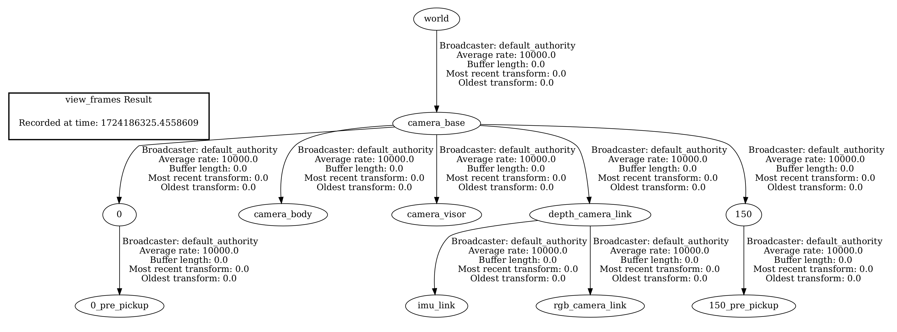

# ArUco Multi-Tag Detection

Camera set up and its basics can be found below in [this README.md file](../src/aruco_pose/README.md)

## Transform Server

When a new tag is detected, it is added to the transform server. They are uniquely identified by their AruCo tag ID. Below image is an example with both the 0 and 150 tag IDs are added to the transform server. 

Custom action-server message `FidPoseControlMsg.action` now has an extra field to insert which sample holder tagged by the tag ID needs to be picked. 

On returning the sample holder, the user has the option to return to a different storage given that the sample holder has previously being pickup up. Below is the second part of the above video where the sample holder being return to a different location:

