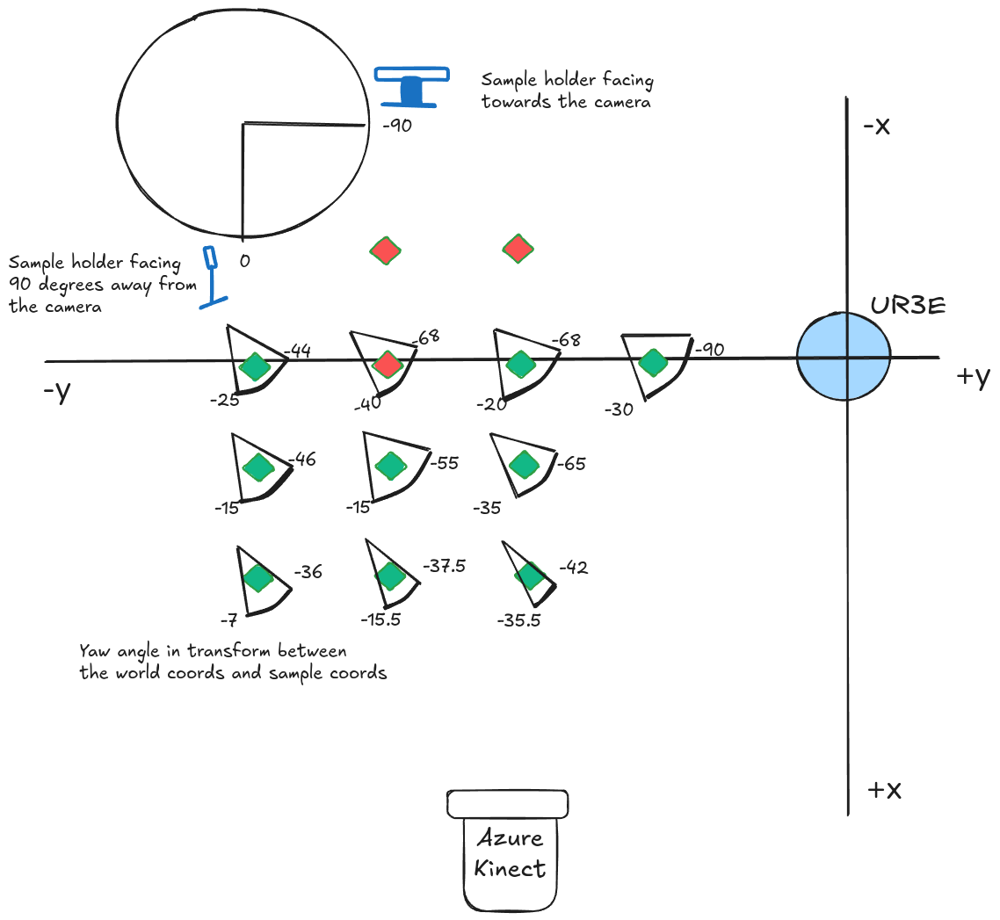
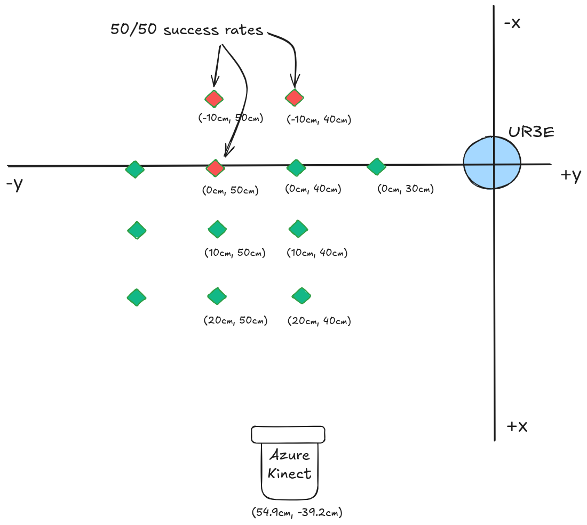

# Sample Placement

Placement of the sample holder has to satisfy two criterion in oder to be successfully picked up by the gripper.
1. The fiducial tag has to be visible to the camera
2. Sample holder has to be facing an angle that is viable for the robotic arm to approach the sample holder face-on.

Following diagram plots angles that satisfies the above two conditions. 

# Robustness Tests

This document records the  results of repeatability tests of the sample place and return. 

## Sample pick and place using fiducial markers

In the below image, the sample holder is places at 10cm intervals. 

Out of 30 placings using the fiducial markers, 24 successes -> 80%.

Failure reasons: At two places that's more than 65cm+ from the camera has a 50-50 marker detection success rate. 

## Sample return using fiducial markers

23/24 successful returns.
Failure reason -> sample holder at storage was moved slightly when pick-up stage as the storage is not fixed.