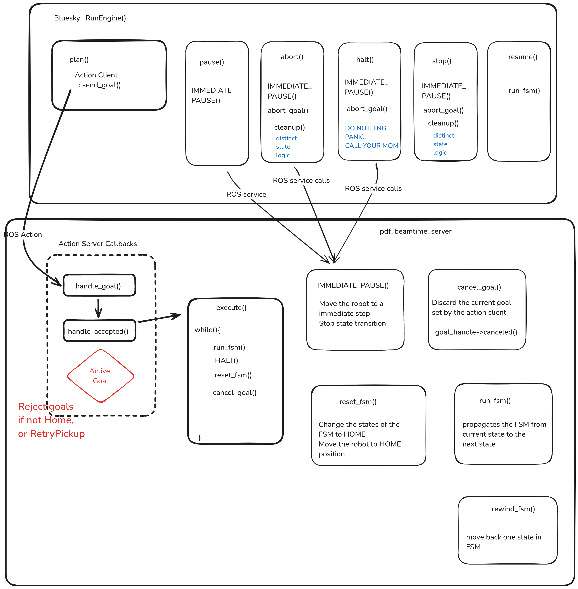
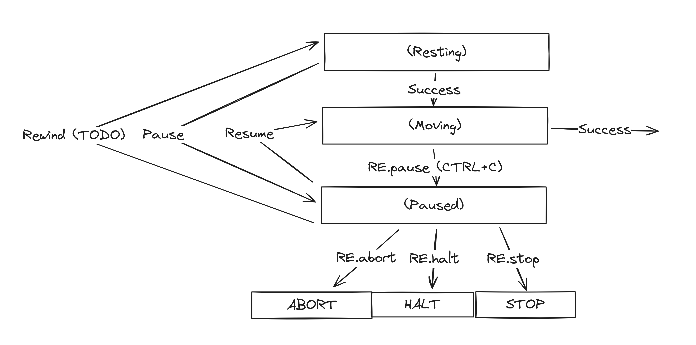

# State Transition in pdf_beamtime

### Bluesky Mapping

The top level tasks are issued via Bluesky commands which are mapped to a ROS2 action server. Below image maps the Bluesky commands to their respective behavior at the action client side. 

### Finite State Machine

The finite state machine handles the state transitions for each of the 'goals' sent via the action server.

### Inner State Machine

Each of the states in the Finite State Machine has 6 sub-states. These sub-states details out the fine-grain bahavior in each of the states. Below image is the state transition diagram for each sub-state (inner states)

